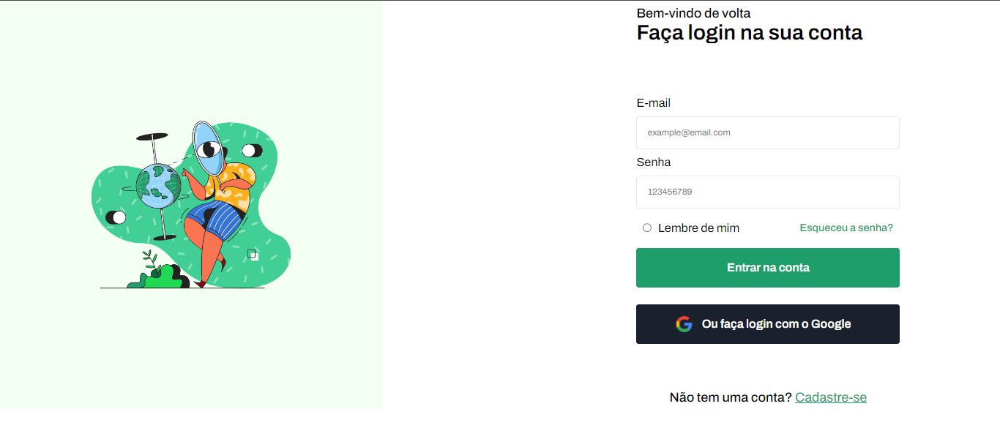

# login-page-challenge

Projeto com uma tela de login feita com js puro + html5 e css3

Este projeto foi desenvolvido com o objetivo de praticar a criação de uma tela de login utilizando apenas JavaScript puro, HTML5 e CSS3.

Alguns pontos importantes:

- O formulário de login possui validação dos campos de usuário e senha para garantir que o usuário preencha os dados corretamente antes de enviar o formulário.

- A estilização da página foi feita apenas com CSS3 sem uso de bibliotecas externas.

- O JavaScript puro foi utilizado para implementar a lógica de validação do formulário e também o controle de exibição de mensagens de erro.

- O projeto serve como base para praticar testes unitários com Jest e também para estudar técnicas de validação em formulários.

- A interface foi desenvolvida pensando em responsividade para funcionar bem em diversos tamanhos de tela.

